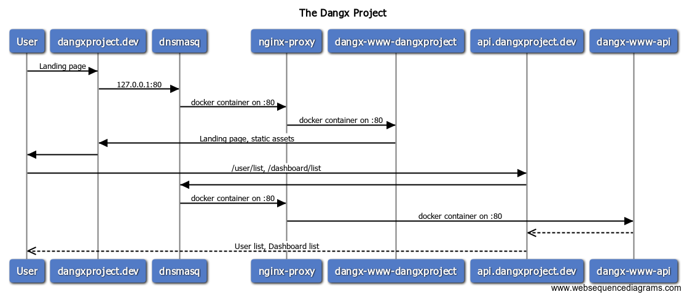

# Dangx Project

Following on the success of the "All-In-One" [Dangx](https://github.com/rixrix/dangx) project which got 8 views and 1 unique visitors from the time of this writing (13/Aug/2017) - 20 days ago, I've broken it down into multiple docker-compose/Dockerfile files.

This is an attempt to build a microservices architecture: API driven, lightweight on infrastructure (Alpine Linux), loosely coupled services. I had this vision in 2016 however it just got materialised recently along with the help of this blogs [1], [2]

# Tech Stack

* Alpine Linux
* NodeJS
* Nginx
* Dnsmasq
* Docker

# Commands / HowTo

* 1. For fresh project, create the special network
  * `./scripts/docker-new-network.sh`
* 2. Build the containers
  * `./scripts/docker-compose-up.sh`
* 3. Destroy the containers, excluding network and images
  * `./scripts/docker-compose-down.sh`
* 4. Restart the containers
  * `./scripts/docker-compose-restart.sh`

# Todo

The list below requires a massive amount of time but definitely doable.

* Deploy to AWS
* Build infra with Terraform
* Use registry like Consul, etc
* Multi-cloud deployment eg. AWS, Google Cloud, Azure
* Use CI
* Others, file an issue

# Services

* www-whoami
  * URL: http://whoami.dev
  * Port: 8000
* www-dangxproject
  * Project landing page, mostly static assets
  * Info
    * URL: http://dangxproject.dev
    * Port: 3000, Expose: 80
* www-api
  * NodeJS-based API
  * Info
    * URL: http://api.dangxproject.dev
    * Port: 3001, Expose: 80

# Notes

* Dnsmasq
  * Configured to only return queries for any host under "dev" eg: xxx.dev, api.dangxproject.dev on 127.0.0.1 IP address
  * command section in docker-compose.dnsmasq.yml and its manpage
* Docker vEthernet on Windows 10
  * Attach the following entries below to your Docker vEthernet IPv4 adapter:
    * DNS Server: 127.0.0.1
    * DNS Suffix: dev
* Tested on Windows 10
  * Windows 10 Pro Insider Release Build: 16251.rs3_release
  * Docker Server Version: 17.06.0-ce
  * Kernel Version: 4.9.36-moby
  * Dell XPS 13 9343

# References

* [1] IBM, Learning Microservices Architecture with Bluemix and Docker
  * http://blog.ibmjstart.net/2015/07/23/learning-microservices-architecture-bluemix-docker-part-1/
* [2] Improving dev environments: All the HTTP things
  * https://adrianperez.org/improving-dev-environments-all-the-http-things/
* Docker 2-way linking
  * https://medium.com/@yani/two-way-link-with-docker-compose-8e774887be41
* Docker Nginx Proxy: https://github.com/jwilder/nginx-proxy
* Docker Dnsmasq
  * https://hub.docker.com/r/andyshinn/dnsmasq/
  * http://www.thekelleys.org.uk/dnsmasq/doc.html
  * http://www.thekelleys.org.uk/dnsmasq/docs/dnsmasq-man.html
* https://jqnotes.blogspot.co.nz/2012/08/configure-windows-7-to-support-dnsmasq.html
* https://stackoverflow.com/questions/330395/dns-problem-nslookup-works-ping-doesnt
* https://www.windowscentral.com/how-change-your-pcs-dns-settings-windows-10
* https://serverfault.com/questions/391914/is-there-a-way-to-use-a-specific-dns-for-a-specific-domain
